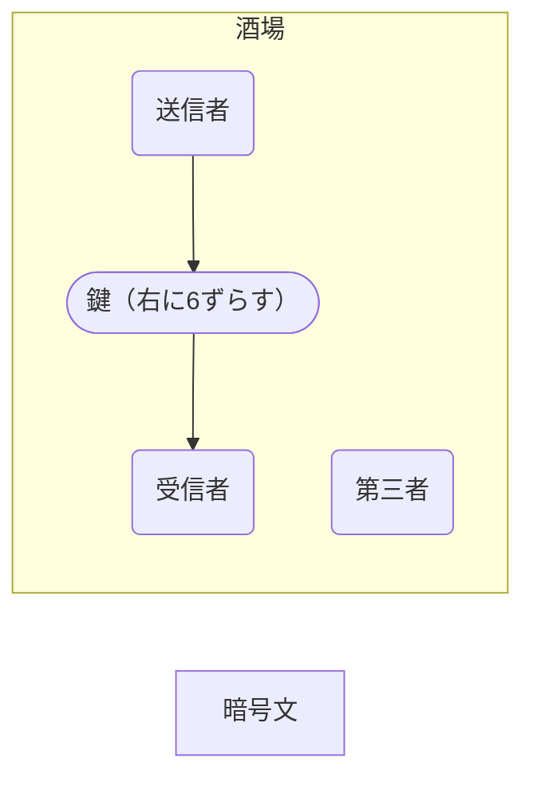
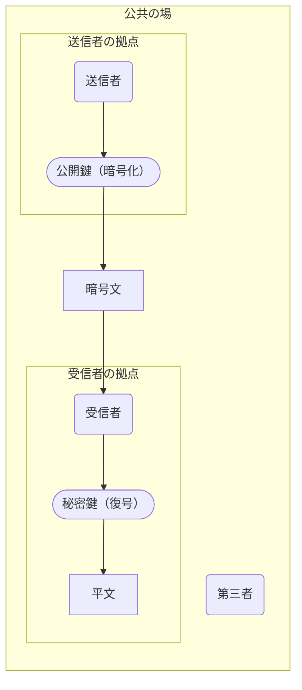
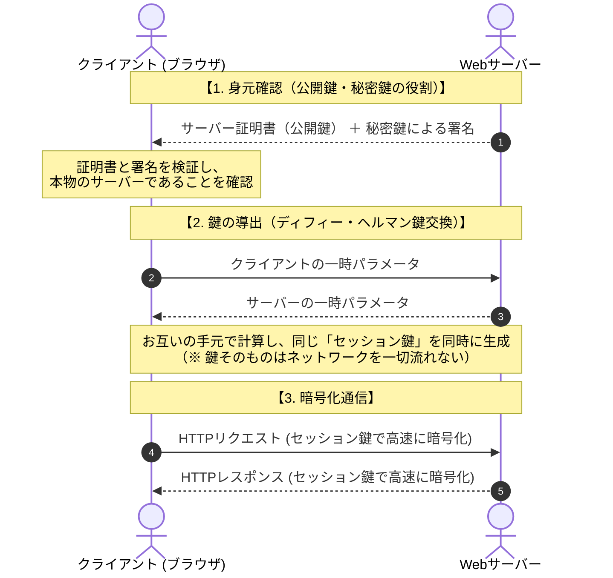

# webを支える暗号化技術（シーザー暗号からTLS）

isPublic: Yes
タグ: article, devs

# そもそも暗号化とは？

- 暗号とは？
    - 第三者が見ても知識がないと解読できないように変換された文
- 暗号の種類
    - コード
        - 語やセマンティックなレベルのものを第三者にわからない語に置き換えたもの
        - 機械性ではなく、組織などで暗黙的に共有されている
        - e.g.「メタアンフェタミン（覚醒剤）」を「クリスタル」と裏社会では異なることばで置き換えている （今はクリスタル＝覚醒剤ということが周知されているため暗号としては意味をなしていないが…）
    - サイファー
        - 文字単位であらかじめ決められた規則によって第三者にわからない暗号文へと変換されたもの
        - 機械的にある規則によって平文を暗号文に変換する
        - 現代の通信やweb技術ではこの種類の暗号が多く使われている

暗号には重要な要素が二つある。

それは「規則（algorithm）」と「鍵（key）」

## シーザー暗号

- 最も単純な暗号の一つに「シーザー暗号」というものがある。
- シーザー暗号は平文の文字を元のアルファベットからxの方向にyずらすという非常に簡単な暗号だが、現代の暗号に共通する「規則」と「鍵」の要素を含んでいる

- 「規則」
    - 平文を暗号文にする方法
- 「鍵」
    - 「規則」をもとに平文を暗号化したり、暗号を複合する上で特定の二者間で共有されているもの

以下がシーザー暗号の例：

```
平文:  
	THE QUICK BROWN FOX JUMPS OVER THE LAZY DOG
	
暗号文: 
	QEB NRFZH YOLTK CLU GRJMP LSBO QEB IXWV ALD
```

- 「規則」
    - 文字をアルファベットから特定の数ずらす
- 「鍵」
    - どの方向にいくつずらすか（例の場合、左に3ずらす）

## シーザー暗号の問題（配送問題）と公開鍵暗号

以下のシナリオを考えてほしい。

- シーザー暗号の暗号文を送る際に、送り先に「鍵」を伝える必要がある。
- 酒場で特定の二者間で鍵の共有が行われていたとする。



- この場合、酒場で第三者に「右に6ずらす」という情報が漏れてしまった場合、方法は簡単に推測されて、暗号文が第三者に復号されてしまう。

シーザー暗号のような暗号化・復号する上で同じ情報が使われている（共通鍵暗号の）場合、必ず、鍵を伝える必要があり、鍵を伝える際に必ずそれが第三者に漏れるリスクがある。

これを「配送の問題」という。

この「配送の問題」を解決するのが、「公開鍵暗号」である。

# 公開鍵暗号

公開鍵暗号は暗号化する上での鍵（公開鍵）と復号する上での鍵（秘密鍵）の二つを用意する。

このことによって、二者間の間で鍵の受け渡しをしなければならない「配送の問題」を解決する。なぜならば、暗号化するための鍵だけが受け渡しされるからだ。



しかし、この公開鍵暗号は暗号化と復号に計算コストがかかる。

HTTPSで暗号化された通信は公開鍵暗号によって暗号化された文のやりとりは行なっていない（これについて調べるまで知らなかった）。

# ウェブを支えるTSL（鍵をそもそも送らない）

- TLS（Transport Layer Security）とは？
    - ネットワーク上でデータを暗号化し、安全に送受信するための通信プロトコル。
    - かつて使われていたSSL（Secure Sockets Layer）の脆弱性を改良した後継規格（最新はTLS 1.3）であり、現在も慣例として「SSL/TLS」と呼ばれることが多い。
- HTTPSとの関係
    - 通常のHTTPは平文でデータを送るため、盗聴や改ざんのリスクに晒されている。
    - そこで、HTTPの通信全体をTLSという暗号化トンネルの中に通すようにしたものがHTTPS（HTTP over TLS）である。

## 鍵を送らない暗号化通信

現行のTLSは、暗号化に使う鍵そのものをネットワークに送信することを行わない**。**

通信の暗号化と安全性の確保は、以下の2つの技術の組み合わせによって成立している。

### ハンドジェイクとHTTPS

- ハンドシェイク
    - クライアントとサーバーは、その通信回限りで使い捨てる「一時パラメータ」だけを互いに送信し合う。
    - 届いたパラメータと自前の秘密数値を計算することで、通信経路上に鍵を一切流すことなく、両者の手元で全く同一の共通鍵（セッション鍵）を同時に生成する。
        - 鍵そのものの受け渡しないため盗聴が不可能である。
        - 仮に将来サーバーの秘密鍵が漏洩しても、過去の通信を遡って復号することができない（前方秘匿性）。
- セッション鍵を使って暗号化された文書のやりとりをする（HTTPS）。

### 公開鍵と秘密鍵の役割（暗号化ではなく「相手の身元証明」に使う）

鍵を自前で生成できるなら、サーバーの「公開鍵」や「秘密鍵」は何のためにあるのか？

答えは、通信相手が本物のサーバーか確かめるためだ（電子署名）。

- 接続時、サーバーは認証局（CA）から発行されたSSL/TLS証明書（サーバー公開鍵入り）をクライアントに提示する。
- サーバーは自らの秘密鍵でデジタル署名をして送る。
- クライアントは証明書のサーバー公開鍵で検証をする。
- 署名が正しければ、正規の秘密鍵を持っている本物のサーバーであると証明される。



- 暗号化
    - 通信経路に流さず手元で生成した「セッション鍵（共通鍵）」で高速に行う。
- 身元認証
    - 認証局の証明書と「公開鍵・秘密鍵」によるデジタル署名で行う。

# 参考

- wikipedia「暗号」[https://ja.wikipedia.org/wiki/暗号](https://ja.wikipedia.org/wiki/%E6%9A%97%E5%8F%B7)
- wikipedia「シーザー暗号」[https://ja.wikipedia.org/wiki/シーザー暗号](https://ja.wikipedia.org/wiki/%E3%82%B7%E3%83%BC%E3%82%B6%E3%83%BC%E6%9A%97%E5%8F%B7)
- wikipedia「暗号理論」[https://ja.wikipedia.org/wiki/暗号理論](https://ja.wikipedia.org/wiki/%E6%9A%97%E5%8F%B7%E7%90%86%E8%AB%96)
- wikipedia「公開鍵暗号」[https://ja.wikipedia.org/wiki/公開鍵暗号](https://ja.wikipedia.org/wiki/%E5%85%AC%E9%96%8B%E9%8D%B5%E6%9A%97%E5%8F%B7)
- wikipedia「Transport Layer Security」[https://en.wikipedia.org/wiki/Transport_Layer_Security](https://en.wikipedia.org/wiki/Transport_Layer_Security)