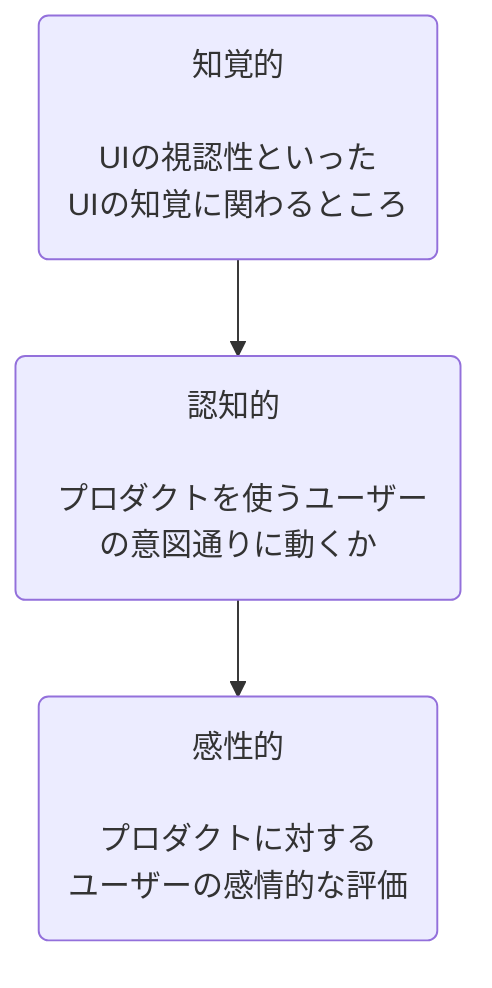

# 認知の視点から見たインターフェースデザイン

isPublic: No
タグ: article

# 認知科学とインターフェースデザイン

GUI（グラフィカルユーザーインターフェース）のグラフィックデザインやインタラクションデザインが生み出された当初から認知科学的な視点が応用されてきた。

- なぜ、認知科学がインターフェースデザインを考える上で重要なのか
- 明日から使える認知科学的な理論
- 興味

# インターフェースデザインをするときに、なぜ認知科学が重要なのか

## 個人的な見解

あるソフトウェアプロダクトをユーザーが使う際、そのプロダクトの良し悪しの評価は全てそのソフトの認知的な要素で決定するから。

なぜそう言えるのか？

## インターフェースデザインの階層的な評価

これらを総合してUIの良さが評価されるが、**知覚・認知・感性の全ての側面がヒトの知覚・認知的特性に依存している**。

- 知覚
    - コンテンツが見えづらい
        - コントラスト
    - 操作がしづらい
        - フィッツの法則（ポインターを目標に到達するまでの時間と目標の大きさの関係）
- 認知
    - 新規のプロダクトに対してユーザーに直感的に操作してもらう
        - 類推・概念メタファー
        - スキーマ
- 感性
    - どうすれば繰り返しユーザーに使ってもらえるか
        - 認知的負荷
        - 内発的動機づけ

# 明日から使える認知科学的な理論

---

## 1. 注意

### 注意の理論

- **能動的注意**
    - ユーザーが「探そう」として意識的に向ける注意（例: 検索窓を探す、保存ボタンを探す）。
- **受動的注意**
    - 突然の動きや高コントラストなど、視覚刺激によって強制的に奪われる注意（ポップアップや点滅するバッジ）
- **注意資源理論**
    - 注意のプールは有限であり、同時に複数の刺激があると処理効率が著しく低下する

### 能動的注意は脆い

- 能動的注意が働いている際は人の集中力を使う
- 集中力は持って10分ほどと言われている
- 意図的に注意を引く挙動（ポップアップや不用意なインディケーション）によって能動的注意は途切れる

### デザイン応用

- ユーザーがよく使うと思われる項目は見覚えのあるわかりやすい形で表示する
- 本当にユーザーに通知する必要のある情報だけをポップアップやインディケーションする
- 配色は最小限にとどめる
    - 意味的なカラーコーディング
    - デザイン的な配色は最小限
- 画面に表示する情報はグループ化して、意味的なまとまりを持たせる
    - 意味に基づいたレイアウトやUI要素

---

## 2. スキーマとメンタルモデル

### スキーマとメンタルモデルの理論

- **スキーマ / フレーム**
    - 過去の経験や知識によって脳内に蓄積された「物事の枠組み・型」（例:「買い物カゴに入れたら、次はレジに進むはずだ」という知識構造）
- **メンタルモデル**
    - ユーザーが対象システムに対して「どう動き、何をすればどう反応するか」を頭の中に描いている因果関係のモデル

### メンタルモデルの乖離がエラーとストレスを生む

- 新しいシステムを触るユーザーは過去のスキーマを無意識に当てはめて操作する
- 開発者が設計した「実装モデル」と、ユーザーが想像している「メンタルモデル」が一致していないと、強いストレスや誤操作（スリップ）が起きる

### デザイン応用

- 業界標準のUIパターンを再発明しない
    - ロゴクリックでホームへ戻る、虫眼鏡は検索など、他サービスで形成されたスキーマに乗っかる（ヤコブの法則）
- 操作に対する結果のフィードバック
    - ボタン押下時のローディング表示や、トグルのON/OFF切り替えのアニメーションで「いま何が起きたか」を可視化する

---

## 3. 類推と概念メタファー

### 類推とメタファーの理論

- **類推（アナロジー）**
    - すでに知っている領域（ベース領域）の知識構造を、よく知らない新しい領域（ターゲット領域）に写像して理解する推論手法
- **概念メタファー**
    - 抽象的で目に見えない概念を、物理的・空間的な実世界の概念に置き換えて把握する認知の仕組み（例: データの集合を「フォルダ」と呼ぶ）
- **シグニファイア**
    - 「どこをどう操作できるか」をユーザーに伝えるための視覚的な手がかり（例: 立体的なボタン、つまみ）

### 物理世界の常識を借りることで学習コストがゼロになる

- デジタル上のデータや処理は本来目に見えないが、物理世界や生活のメタファーを借りることで、説明書なしで直感的に扱い方が伝わる
- ただし、メタファーが現実世界の制約と矛盾していると（例: ホバーアニメーションがあるdivを押しても何も起こらない（AI生成のUIにありがち））、かえってユーザーに認知的混乱を与える

### デザイン応用

- 物理世界の空間概念や振る舞いをUIのレイヤー構造に適用する
    - 奥行きの表現（モーダル、ドロップシャドウ）
    - スキューモーフィズム（物理世界の物体の質感を模倣して類推しやすくする）
- 日常生活で誰もが知っている構造的メタファーを採用する
    - 「ショッピングカート」「タブ」「サイドバー」「ブックマーク」などの馴染みのある命名、レイアウト、アイコンを使う

---

# 参考

- 志堂寺和則（2019）『ヒューマンインターフェース』コロナ社
- 大堀壽夫（2009）『認知言語学』東京大学出版会
